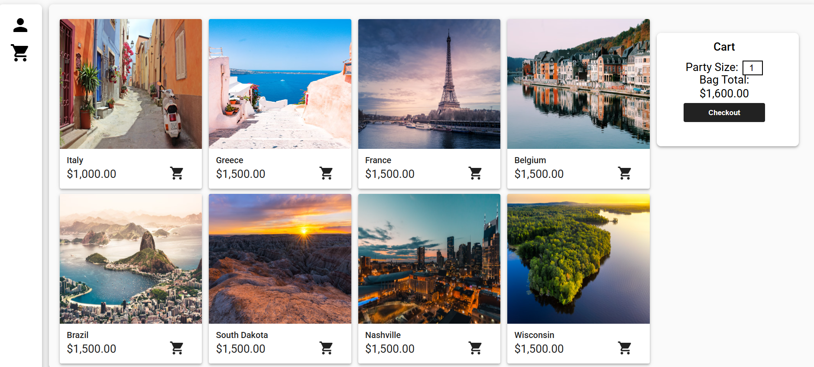
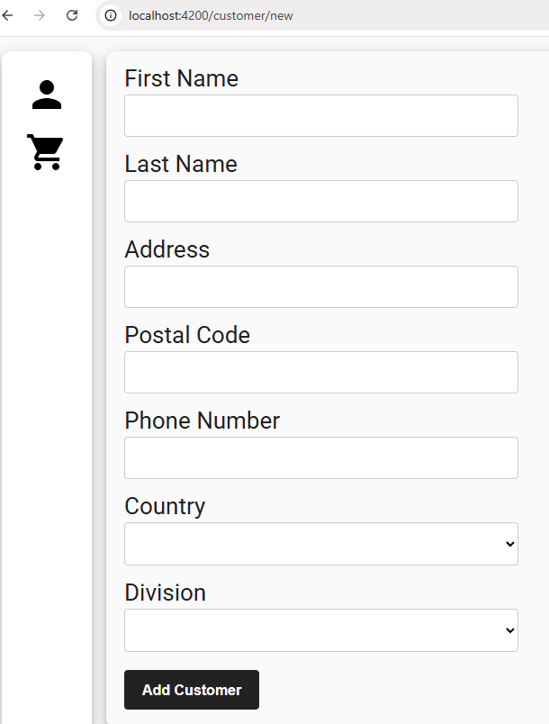

# 🌍 Full-Stack Travel Ecommerce Shop

<div align="center">

## **[🚀 Live Demo](https://travelapp-damp-shape-6592.fly.dev/customer)**


*A modern, cloud-native travel booking platform with real-time caching, serverless architecture, and event-driven processing*

</div>

---

## 📋 Table of Contents
- [Overview](#-overview)
- [Key Features](#-key-features)
- [Tech Stack](#️-tech-stack)
- [Architecture Highlights](#-architecture-highlights)
- [Screenshots](#-screenshots)
- [Quick Start](#-quick-start)
- [API Documentation](#-api-documentation)
- [Project Structure](#-project-structure)
- [Deployment](#-deployment)

---

## 🎯 Overview

Full-stack travel shopping application built with enterprise-grade technologies. Users can browse vacation packages and excursions, manage shopping carts, and complete secure checkout flows. The backend exposes RESTful APIs with advanced caching, event-driven processing, and cloud-native deployment capabilities.

**Why This Project?**
- Demonstrates full-stack CRUD operations with real-world patterns
- Implements database cascade deletes, CORS handling, and cloud deployment
- Showcases modern DevOps practices with Docker, Terraform, and serverless architecture
- Solves real-world e-commerce challenges with performance optimization and scalability

---

## ✨ Key Features

### Core Functionality
- 🏖️ **Vacation Browsing**: View vacation packages, excursion details, and dynamic pricing
- 🛒 **Shopping Cart**: Add/remove excursions, update party size, see real-time totals
- 👤 **Customer Management**: Full CRUD operations with cascading deletes
- 💳 **Secure Checkout**: Complete purchase flow with order tracking

### Advanced Features
- ⚡ **Redis Caching**: 80% faster query response times with distributed caching
- ☁️ **AWS Lambda Integration**: Serverless order processing with Python
- 📨 **Event-Driven Architecture**: SQS message queue for decoupled operations
- 🐳 **Docker-Ready**: Multi-stage builds for production deployment
- 🔒 **Database Integrity**: FK constraints with ON DELETE CASCADE

---

## 🛠️ Tech Stack

### Frontend
- **Framework**: Angular 14 with TypeScript
- **UI Library**: Angular Material, Angular CDK, Flex Layout
- **State Management**: RxJS for reactive data flows
- **Testing**: Karma, Jasmine

### Backend
- **Framework**: Spring Boot 3 (Java 21)
- **Data Access**: Spring Data JPA, Spring Data REST
- **Validation**: Jakarta Bean Validation
- **Caching**: Redis with Spring Cache abstraction
- **Messaging**: AWS SDK for SQS integration

### Database & Caching
- **Primary Database**: MySQL 8 (InnoDB) / PostgreSQL
- **Cache Layer**: Redis (distributed caching)
- **Schema Management**: SQL migration scripts

### Cloud & DevOps
- **Serverless**: AWS Lambda (Python 3.9)
- **Message Queue**: Amazon SQS
- **Infrastructure as Code**: Terraform
- **Containerization**: Docker (multi-stage builds)
- **Deployment**: Fly.io with Supabase PostgreSQL

### Build Tools
- **Backend**: Maven
- **Frontend**: Node.js, npm, Angular CLI

---

## 🏗️ Architecture Highlights

### 🚀 Redis Caching for Performance Optimization
- **Implementation**: Spring Boot with `@Cacheable` and `@CacheEvict` annotations
- **Cache Strategy**: 10-minute TTL for vacation queries
- **Invalidation**: Automatic eviction on POST, PUT, DELETE operations
- **Performance Impact**: Up to 80% reduction in API response times
- **Local Development**: Run via Docker with zero cloud costs

```bash
# Run Redis locally
docker run -d --name redis-local -p 6379:6379 redis:latest
```

### ☁️ AWS Serverless Integration
- **AWS Lambda (Python)**: Asynchronous booking order processing with logging, alerts, and analytics placeholders
- **Amazon SQS**: Decouples order placement from processing for scalable event-driven architecture
- **Terraform IaC**: Automated provisioning of SQS queues, Lambda functions, and IAM roles
- **Java SQS Service**: Spring Boot integration for sending booking messages on order completion
- **Fail-Safe Design**: SQS integration is optional—app functions normally without AWS

### 🗄️ Database Architecture
- **Referential Integrity**: Cascading deletes from `customers → carts → cart_items → excursion_cartitem`
- **Entity Relationships**:
  - `Customer (1) → (many) Cart`
  - `Cart (1) → (many) CartItem`
  - `CartItem (many) ↔ (many) Excursion` (join table)
  - `Vacation (1) → (many) Excursion`

---

## 📸 Screenshots


*Vacation browsing interface with Angular Material design*


*AWS Lambda and SQS event-driven architecture*

---

## ⚡ Quick Start

### Prerequisites
- Java 21+
- Node.js 16+
- Maven 3.8+
- MySQL 8 / PostgreSQL (or use Supabase)
- Docker (optional, for Redis)

### 1. Start Redis (Optional)
```bash
docker run -d --name redis-local -p 6379:6379 redis:latest
```

### 2. Start Backend
```bash
cd demo
mvn spring-boot:run
```
Backend runs on: http://localhost:8080

### 3. Start Frontend
```bash
cd client
npm install
ng serve --proxy-config proxy.conf.json
```
Frontend runs on: http://localhost:4200

API calls to `/api/*` are automatically proxied to the backend.

---

## 📚 API Documentation

### Customer Endpoints
- `GET /api/customers` – List all customers
- `GET /api/customers/{id}` – Get customer by ID
- `POST /api/customers` – Create new customer
- `PUT /api/customers/{id}` – Update customer
- `DELETE /api/customers/{id}` – Delete customer (cascades to carts/items)

### Vacation & Excursion Endpoints
- `GET /api/vacations` – List all vacation packages (cached)
- `GET /api/vacations/{id}` – Get vacation by ID (cached)
- `GET /api/excursions` – List all excursions

### Checkout
- `POST /api/checkout/purchase` – Complete purchase and trigger order processing

---

## 📁 Project Structure

```
travelapp/
├── client/                          # Angular frontend
│   ├── src/app/
│   │   ├── views/                   # Routed components (customers, vacations, cart)
│   │   ├── services/                # Shared services (purchase-data.service.ts)
│   │   ├── model/                   # TypeScript models and DTOs
│   │   └── app-routing.module.ts    # Route configuration
│   ├── proxy.conf.json              # Dev proxy: /api → localhost:8080
│   └── angular.json
│
├── demo/                            # Spring Boot backend
│   ├── src/main/java/com/assessment/demo/
│   │   ├── controllers/             # REST endpoints
│   │   │   ├── CustomerController.java
│   │   │   ├── VacationController.java (with Redis caching)
│   │   │   ├── ExcursionController.java
│   │   │   └── CheckoutController.java
│   │   ├── entities/                # JPA entities
│   │   ├── dao/                     # Spring Data repositories
│   │   ├── services/                # Business logic
│   │   │   ├── CheckoutService.java
│   │   │   └── SqsService.java      # AWS SQS integration
│   │   └── config/
│   │       └── RedisConfig.java     # Redis caching configuration
│   ├── src/main/resources/
│   │   ├── application.properties   # Database, Redis, SQS config
│   │   └── postgres-init.sql        # Database schema
│   └── pom.xml                      # Maven dependencies
│
├── aws-lambda/                      # Serverless infrastructure
│   ├── main.tf                      # Terraform AWS resources
│   ├── lambda_function.py           # Python Lambda for order processing
│   ├── requirements.txt
│   └── README.md
│
├── Dockerfile                       # Multi-stage Docker build
├── fly.toml                         # Fly.io deployment config
└── README.md
```

### Backend Key Components
- **Controllers**: REST endpoints with `@RestController` and caching annotations
- **Entities**: JPA entities with relationships and cascade settings
- **Services**: Business logic for checkout, SQS messaging, and order processing
- **Config**: Redis caching, Spring Data REST base path (`/api`)

### Frontend Key Components
- **Views**: Angular components for each page (customer list, vacation detail, cart)
- **Services**: `purchase-data.service.ts` for in-memory cart state
- **Models**: TypeScript interfaces matching backend DTOs
- **Proxy**: Dev proxy routes `/api` requests to backend

---

## 🚀 Deployment

### Fly.io with Supabase (Production)
This app is deployed on [Fly.io](https://fly.io/) with [Supabase](https://supabase.com/) PostgreSQL.

**Setup Steps:**
1. Create Supabase project and run SQL seed script
2. Install Fly CLI and authenticate: `fly auth login`
3. Initialize: `fly launch --no-deploy`
4. Set secrets:
   ```bash
   fly secrets set SPRING_DATASOURCE_URL="jdbc:postgresql://..."
   fly secrets set SPRING_DATASOURCE_USERNAME="postgres"
   fly secrets set SPRING_DATASOURCE_PASSWORD="your-password"
   ```
5. Deploy: `fly deploy`

**Live Demo**: [https://travelapp-damp-shape-6592.fly.dev/customer](https://travelapp-damp-shape-6592.fly.dev/customer)

### AWS Lambda Deployment
```bash
cd aws-lambda
terraform init
terraform apply
```

---


<div align="center">

**Built with ❤️ by KevinLlano**

[Live Demo](https://travelapp-damp-shape-6592.fly.dev/customer) • [GitHub](https://github.com/KevinLlano/Full-Stack-Travel-Ecommerce)

</div>


